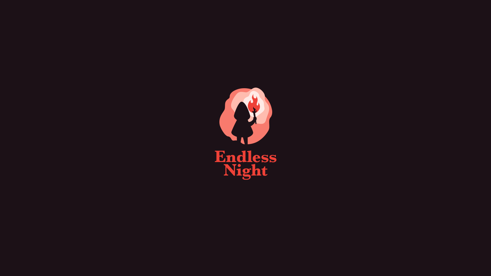

Play it here: [endless-night-demo](https://owsiakl.github.io/endless-night-demo/).

Endless Night is a demo I've made strictly for learning purposes,
so I could learn topics like 3d space, shaders, skinning, skeletal animation, textures, shadows, etc.

It's made with typescript and uses custom vanilla webgl renderer.

This is not intended to be a full scale game, nor I plan to turn it into one.

# Scene
- Press left mouse button and move to rotate the camera.
- Use `W` `A` `S` `D` keys to move around.
- Press `LEFT SHIFT` to run.


# Local development
Requires nodejs runtime environment, you can get it on [https://nodejs.org](https://nodejs.org) website.

To start project, first install all necessary dependencies:
```shell
npm ci
```

then compile stylesheets: 
```shell
npm sass:build
```

and then start webpack dev server:
```shell
npm start
```

Project is available under: [http://localhost:8080](http://localhost:8080).

### Debug
Some debug information are available by appending `?debug` query string into the URL: [http://localhost:8080?debug](http://localhost:8080?debug).
